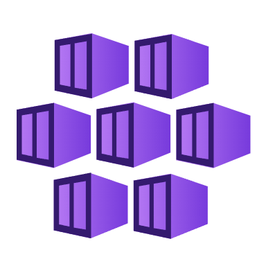
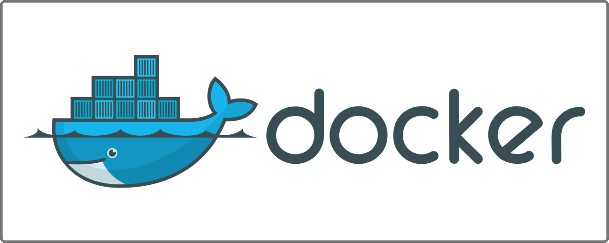
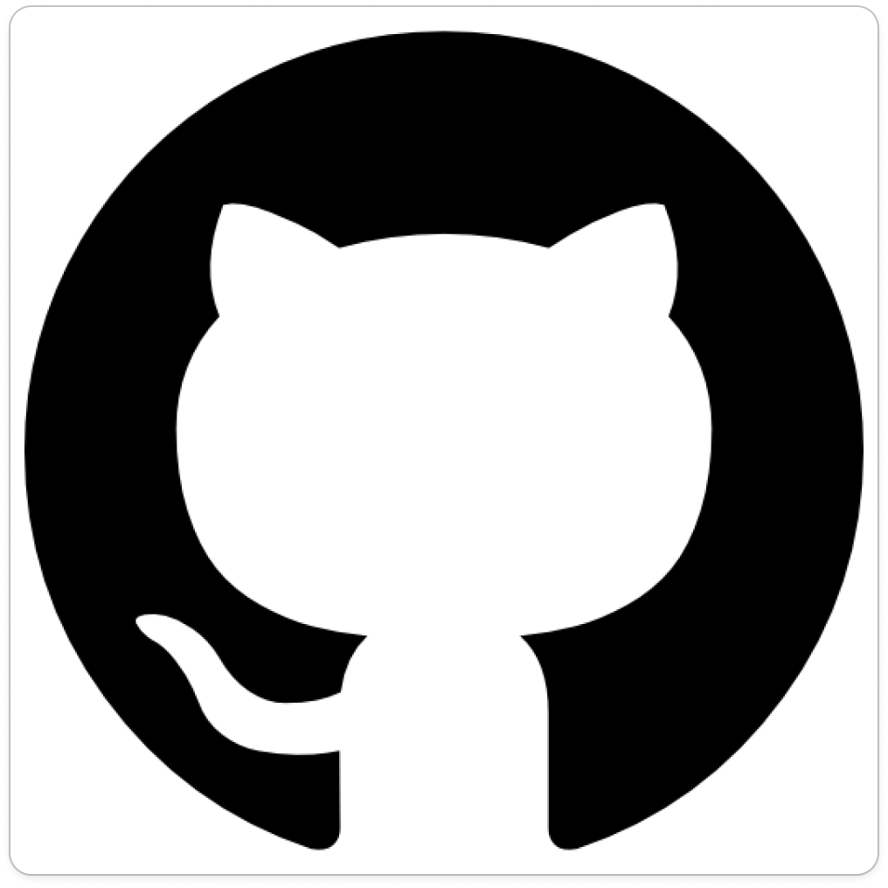
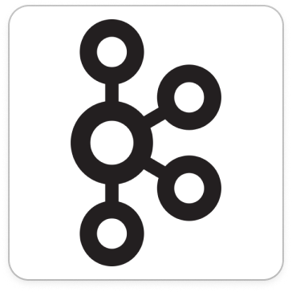
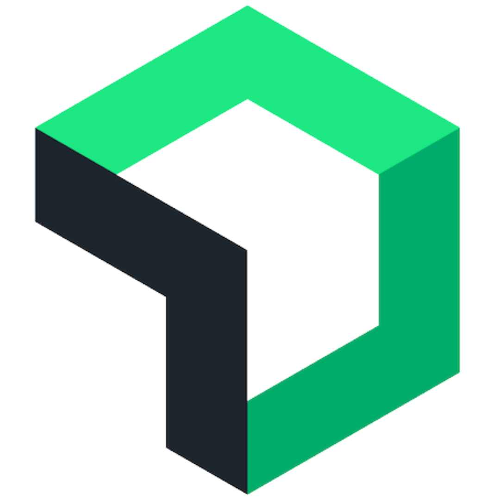
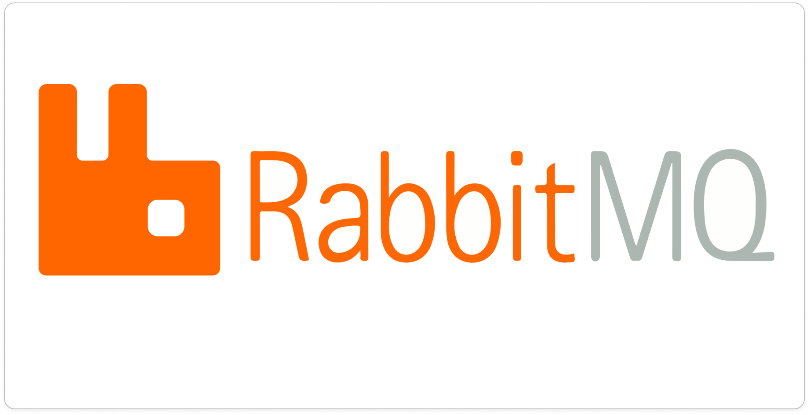
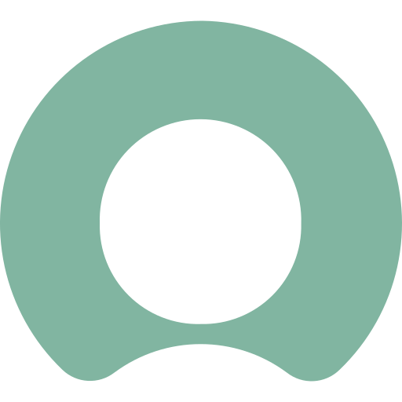
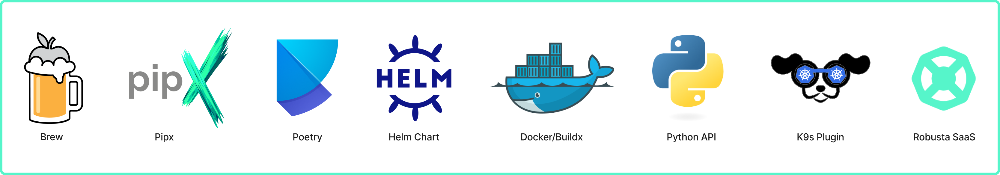
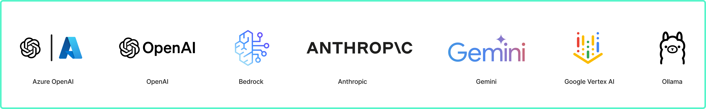

  <h1 align="center">HolmesGPT — The CNCF SRE Agent</h1>

  

    <a href="#installation"><strong>Installation</strong></a> |
    <a href="https://holmesgpt.dev/"><strong>Docs</strong></a> |
    
  

Open-source AI agent for investigating production incidents and finding root causes. Works with any stack — Kubernetes, VMs, cloud providers, databases, and SaaS platforms. We are a [Cloud Native Computing Foundation](https://www.cncf.io/) sandbox project. Originally created by [Robusta.Dev](http://robusta.dev), with major contributions from [Microsoft](https://microsoft.com/).

## New: Operator Mode — Find Problems 24/7 in the Background

Most AI agents are great at troubleshooting problems, but still need a human to notice something is wrong and trigger an investigation. [Operator mode](https://holmesgpt.dev/operator/) fixes that — HolmesGPT runs in the background 24/7, spots problems before your customers notice, and messages you in Slack with the fix. Connect the [GitHub integration](https://holmesgpt.dev/data-sources/builtin-toolsets/github-mcp/) and it can even open PRs to fix what it finds.

While the operator itself runs in Kubernetes, health checks can query any data source Holmes is connected to — VMs, cloud services, databases, SaaS platforms, and more.

- **[Deployment verification](https://holmesgpt.dev/operator/deployment-verification/)** — Deploy a health check alongside your app to verify the new version is healthy
- **[Scheduled health checks](https://holmesgpt.dev/operator/scheduled-health-checks/)** — Continuously monitor services and catch regressions automatically

## Features

- **Petabyte-scale data**: Server-side filtering, JSON tree traversal, and tool output transformers keep large payloads out of context windows
- **Memory-safe execution**: Per-tool memory limits, streaming large results to disk, and automatic output budgeting prevent OOM kills when querying large observability datasets
- **[Deep integrations](https://holmesgpt.dev/data-sources/builtin-toolsets/)**: Prometheus, Grafana, Datadog, Kubernetes, and [many more](#-data-sources)—plus any [REST API](https://holmesgpt.dev/data-sources/api-toolsets/)
- **Bidirectional alert integrations**: Fetch alerts from AlertManager, PagerDuty, OpsGenie, or Jira—and write findings back
- **[Any LLM provider](https://holmesgpt.dev/ai-providers/)**: OpenAI, Anthropic, Azure, Bedrock, Gemini, and more
- **No Kubernetes required**: Works with any infrastructure — VMs, bare metal, cloud services, or containers

## How it Works

HolmesGPT uses an **agentic loop** to query live observability data from multiple sources and identify root causes.

### 🔗 Data Sources

HolmesGPT integrates with popular observability and cloud platforms. The following data sources ("toolsets") are built-in. [Add your own](https://holmesgpt.dev/data-sources/custom-toolsets/).

| Data Source | Notes |
|-------------|-------|
| [ **AKS**](https://holmesgpt.dev/data-sources/builtin-toolsets/aks/) | Azure Kubernetes Service cluster and node health diagnostics |
| [ **ArgoCD**](https://holmesgpt.dev/data-sources/builtin-toolsets/argocd/) | Get status, history and manifests and more of apps, projects and clusters |
| [ **AWS**](https://holmesgpt.dev/data-sources/builtin-toolsets/aws/) | RDS events, instances, slow query logs, and more (MCP) |
| [ **Azure**](https://holmesgpt.dev/data-sources/builtin-toolsets/azure-mcp/) | Azure resources and diagnostics (MCP) |
| [ **Azure SQL**](https://holmesgpt.dev/data-sources/builtin-toolsets/azure-sql/) | Database health, performance, connections, and slow queries |
| [ **Confluence**](https://holmesgpt.dev/data-sources/builtin-toolsets/confluence/) | Private runbooks and documentation |
| [ **Confluence (MCP)**](https://holmesgpt.dev/data-sources/builtin-toolsets/confluence-mcp/) | Private runbooks and documentation (MCP) |
| [ **Coralogix**](https://holmesgpt.dev/data-sources/builtin-toolsets/coralogix-logs/) | Retrieve logs for any resource |
| [ **Crossplane**](https://holmesgpt.dev/data-sources/builtin-toolsets/crossplane/) | Troubleshoot Crossplane providers, compositions, claims, and managed resources |
| [ **Datadog**](https://holmesgpt.dev/data-sources/builtin-toolsets/datadog/) | Query logs, metrics, and traces |
| [ **Docker**](https://holmesgpt.dev/data-sources/builtin-toolsets/docker/) | Get images, logs, events, history and more |
| [ **Elasticsearch / OpenSearch**](https://holmesgpt.dev/data-sources/builtin-toolsets/elasticsearch/) | Query logs, cluster health, shard and index diagnostics |
| [ **GCP**](https://holmesgpt.dev/data-sources/builtin-toolsets/gcp/) | Google Cloud Platform resources (MCP) |
| [ **GitHub**](https://holmesgpt.dev/data-sources/builtin-toolsets/github-mcp/) | Repositories, issues, and pull requests (MCP) |
| [ **GitLab**](https://holmesgpt.dev/data-sources/builtin-toolsets/gitlab-mcp/) | Projects, merge requests, issues, and CI/CD pipelines (MCP) |
| [ **Jenkins (MCP)**](https://holmesgpt.dev/data-sources/builtin-toolsets/jenkins-mcp/) | Build status, pipeline logs, and job history (MCP) |
| [ **Grafana**](https://holmesgpt.dev/data-sources/builtin-toolsets/grafanadashboards/) | Query and analyze dashboard configurations and panels |
| [ **Helm**](https://holmesgpt.dev/data-sources/builtin-toolsets/helm/) | Release status, chart metadata, and values |
| [ **Internet**](https://holmesgpt.dev/data-sources/builtin-toolsets/internet/) | Public runbooks, community docs, etc. |
| [ **Kafka**](https://holmesgpt.dev/data-sources/builtin-toolsets/kafka/) | Fetch metadata, list consumers and topics or find lagging consumer groups |
| [ **Kubernetes**](https://holmesgpt.dev/data-sources/builtin-toolsets/kubernetes/) | Pod logs, K8s events, and resource status (kubectl describe) |
| [ **Kubernetes Remediation (MCP)**](https://holmesgpt.dev/data-sources/builtin-toolsets/kubernetes-remediation-mcp/) | Apply fixes like scaling, rollbacks, and resource edits (MCP) |
| [ **Loki**](https://holmesgpt.dev/data-sources/builtin-toolsets/grafanaloki/) | Query logs for Kubernetes resources or any query |
| [ **MariaDB**](https://holmesgpt.dev/data-sources/builtin-toolsets/mariadb-mcp/) | MariaDB database queries and diagnostics (MCP) |
| [ **MongoDB**](https://holmesgpt.dev/data-sources/builtin-toolsets/mongodb/) | Query data, diagnose performance, inspect schemas, find slow operations |
| [ **MongoDB Atlas**](https://holmesgpt.dev/data-sources/builtin-toolsets/mongodb-atlas/) | Cluster health, slow queries, and performance diagnostics |
| [ **NewRelic**](https://holmesgpt.dev/data-sources/builtin-toolsets/newrelic/) | Investigate alerts, query tracing data |
| [ **OpenShift**](https://holmesgpt.dev/data-sources/builtin-toolsets/openshift/) | Projects, routes, builds, security context constraints, and deployment configs |
| [ **Prefect (MCP)**](https://holmesgpt.dev/data-sources/builtin-toolsets/prefect-mcp/) | Workflow orchestration monitoring, flow runs, and worker health (MCP) |
| [ **Prometheus**](https://holmesgpt.dev/data-sources/builtin-toolsets/prometheus/) | Investigate alerts, query metrics and generate PromQL queries |
| [ **RabbitMQ**](https://holmesgpt.dev/data-sources/builtin-toolsets/rabbitmq/) | Partitions, memory/disk alerts, troubleshoot split-brain scenarios and more |
| [ **Robusta**](https://holmesgpt.dev/data-sources/builtin-toolsets/robusta/) | Multi-cluster monitoring, historical change data, runbooks, PromQL graphs and more |
| [ **ServiceNow**](https://holmesgpt.dev/data-sources/builtin-toolsets/servicenow/) | Query tables and incident records |
| [ **Sentry**](https://holmesgpt.dev/data-sources/builtin-toolsets/sentry-mcp/) | Error tracking, issues, and performance monitoring (MCP) |
| [ **Slab**](https://holmesgpt.dev/data-sources/builtin-toolsets/slab/) | Team knowledge base and runbooks on demand |
| **Splunk** | Log search and analysis (MCP) |
| [ **SQL Databases**](https://holmesgpt.dev/data-sources/builtin-toolsets/database-postgresql/) | PostgreSQL, MySQL, ClickHouse, MariaDB, SQL Server, SQLite |
| [ **Tempo**](https://holmesgpt.dev/data-sources/builtin-toolsets/grafanatempo/) | Fetch trace info, debug issues like high latency in application |
| [ **VictoriaLogs**](https://holmesgpt.dev/data-sources/builtin-toolsets/victorialogs/) | Query logs from VictoriaLogs using LogsQL |
| **VictoriaMetrics** | Query metrics from a Prometheus-compatible TSDB (`vmsingle` / `vmcluster`) |
| [ **Zabbix**](https://holmesgpt.dev/data-sources/builtin-toolsets/zabbix/) | Monitor hosts, problems, events, triggers, and historical metrics |

See the [full list of built-in toolsets](https://holmesgpt.dev/data-sources/builtin-toolsets/) for additional integrations including Cilium, KubeVela, Notion, and more.

### 🚀 End-to-End Automation

HolmesGPT can fetch alerts/tickets to investigate from external systems, then write the analysis back to the source or Slack.

| Integration             | Status    | Notes |
|-------------------------|-----------|-------|
| Slack                   | ✅        | [Demo.](https://www.loom.com/share/afcd81444b1a4adfaa0bbe01c37a4847) Available via [Robusta](https://home.robusta.dev/) |
| Microsoft Teams         | ✅        | Available via [Robusta](https://home.robusta.dev/) |
| Prometheus/AlertManager | ✅        | Robusta or HolmesGPT CLI |
| PagerDuty               | ✅        | HolmesGPT CLI only |
| OpsGenie                | ✅        | HolmesGPT CLI only |
| Jira                    | ✅        | HolmesGPT CLI only |
| GitHub                  | ✅        | HolmesGPT CLI only |

## Installation

Read the [installation documentation](https://holmesgpt.dev/installation/cli-installation/) to learn how to install HolmesGPT.

## Supported LLM Providers

Read the [LLM Providers documentation](https://holmesgpt.dev/ai-providers/) to learn how to set up your LLM API key.

## Using HolmesGPT

See the [walkthrough documentation](https://holmesgpt.dev/latest/walkthrough/) for usage guides, including:

- [Interactive mode](https://holmesgpt.dev/latest/walkthrough/interactive-mode/) for asking questions and follow-ups
- [Investigating Prometheus alerts](https://holmesgpt.dev/latest/walkthrough/investigating-prometheus-alerts/)
- [CI/CD troubleshooting](https://holmesgpt.dev/latest/walkthrough/cicd-troubleshooting/)

## 🔐 Data Privacy

By design, HolmesGPT has **read-only access** and respects RBAC permissions. It is safe to run in production environments.

## License
Distributed under the Apache 2.0 License. See [LICENSE](https://github.com/HolmesGPT/holmesgpt/blob/master/LICENSE) for more information.
<!-- Change License -->

## Community

Join our community to discuss the HolmesGPT roadmap and share feedback:

- [Community Meetups](https://docs.google.com/document/d/1q3L2iUd8tNu-NmZ6QIVOJcCLHrile9CC5QguOGTn_tg/edit?tab=t.0#heading=h.ihdnrt5bstrv)

## Support

If you have any questions, feel free to message us on [HolmesGPT Slack Channel](https://cloud-native.slack.com/archives/C0A1SPQM5PZ)

## How to Contribute

Please read our [CONTRIBUTING.md](CONTRIBUTING.md) for guidelines and instructions.

For help, contact us on [Slack](https://cloud-native.slack.com/archives/C0A1SPQM5PZ) or ask [DeepWiki AI](https://deepwiki.com/HolmesGPT/holmesgpt) your questions.

Please make sure to follow the CNCF code of conduct - [details here](https://github.com/HolmesGPT/holmesgpt/blob/master/CODE_OF_CONDUCT.md).

