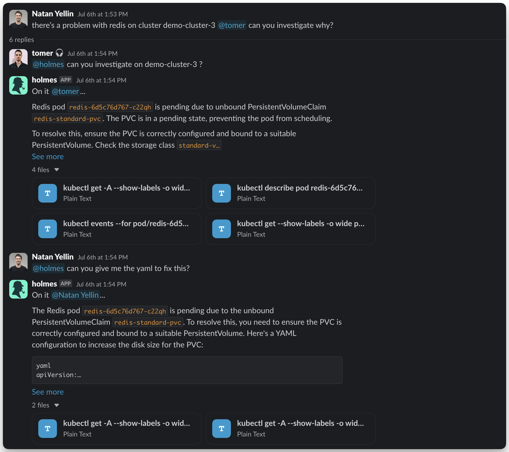

# Slack Bot (3&#8203;rd party)

The HolmesGPT Slack bot is available via [Robusta.dev](https://home.robusta.dev/), which created HolmesGPT and donated it to the CNCF.

First install [Robusta](ui-installation.md), then tag HolmesGPT in any Slack message for instant analysis.

### Setup Slack Bot

{:target="\_blank"}

## Next Steps

-   **[Recommended Setup](../data-sources/recommended-setup.md)** - Connect metrics, logs, and cloud providers to unlock deeper investigations
-   **[All Data Sources](../data-sources/index.md)** - Browse the full list of 38+ built-in integrations

## Need Help?

-   **[Join our Slack](https://cloud-native.slack.com/archives/C0A1SPQM5PZ){:target="\_blank"}** - Get help from the community
-   **[Request features on GitHub](https://github.com/HolmesGPT/holmesgpt/issues){:target="\_blank"}** - Suggest improvements or report bugs
-   **[Troubleshooting guide](../reference/troubleshooting.md)** - Common issues and solutions
