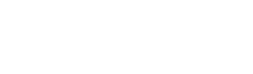

<p align="center">
  
</p>

<p align="center">
 An Opinionated Specification for Running Agentic Workloads on Kubernetes
</p>

<p align="center">
  <a href="https://nightshift.sh">Website</a> &middot;
  <a href="https://docs.nightshift.sh">Docs</a> &middot;
  <a href="https://join.slack.com/t/nightshiftoss/shared_invite/zt-3p5dshiiq-hjB8558QvURDgqqCI7e8RQ">Slack</a>
</p>

---
# Nightshift

An open-source specification for running agents on Kubernetes, which includes the `nightshift-ui`, `nigthshift-api`, and various Agent workers.

Nightshift is a pluggable platform that that unifies every current AI capability into a single system reaching feature parity with Perplexity Computer, Claude, and ChatGPT.

Nightshift defines a small set of gRPC services. They include Storage, Config, Secrets, Workers, Scheduling, and Artifacts.  Together these services describe what it means to run and operate agents at scale. 

The spec is protocol-buffer-driven, transport-agnostic (gRPC with grpc-gateway REST transcoding), and language-neutral: any implementation that
speaks the wire contracts and honors the semantic-contract docs is conformant. 

> Note that this is a new project and in active development. The API is not yet stable.
> If you're looking to run Nigthshift in production, reach out to gianni@nightshift.sh. 
> We can help you work through the rough edges.

## Quick start

Kubernetes is the target runtime. The fastest way to get started
locally is [kind](https://kind.sigs.k8s.io/). Prereqs:

- `kind`
- `kubectl`
- `helm`
- `Docker`

A convenience Makefile gates the workflow. If you don't have a cluster running, `make kind-up` creates one named `nightshift-dev`. 
If you already have a cluster, set `KUBECONFIG` (`kubectl config use-context kind-nightshift-dev`) to point at it and skip straight to one of the `kind-deploy*` targets.

There are three install tiers, each a strict superset of the previous:

For new users, **`kind-quickstart` is the recommended starting point**, it spins up the full stack on a local `kind` cluster.

### Set up the cluster  

```bash
make kind-up                  # creates the kind cluster
```

### Deploy nightshift helm chart

```bash
make kine-quickstart
```

This will give you the full end-to-end nightshift stack. 

After running `make kind-quickstart` port-forward the UI and OpenBao:

Port forward the UI:

```bash
kubectl -n nightshift port-forward svc/nightshift-nightshift-ui 13000:3000 
```

Port forward the OpenBao OIDC and secret management service:

```bash
kubectl -n nightshift port-forward svc/openbao 18200:8200 
```

Get the seeded admin password:

```bash
kubectl -n nightshift get secret openbao-admin-seed \
  -o jsonpath='{.data.password}' | base64 -d
```

Open <http://localhost:13000/login>, click **Sign in with OpenBao**, and authenticate with `admin` + the password and above. 

### Use the Claude worker 

The default worker image `nightshift-worker` is a simulation that returns a canned reply. This is mainly used for getting started without needing an LLM provider api key.
However, if you'd like to run real prompts, you'll need to swap in a worker that calls an LLM.

Set your Anthropic API key as a secret in OpenBao.

You'll need the root token first:

```bash
export VAULT_TOKEN=$(kubectl -n nightshift get secret openbao-seed -o jsonpath='{.data.root-token}' | base64 -d)
```

```
kubectl -n nightshift exec openbao-0 -c openbao -- \
  env VAULT_TOKEN=$VAULT_TOKEN \
  bao kv put secret/nightshift/anthropic-api-key api-key=sk-ant-XXXX
```

Flip the worker image and enable the workerClaude env wiring

```bash
helm -n nightshift upgrade nightshift deploy/charts/nightshift \
  --reuse-values \
  --set nightshift_api.worker.repository=nightshift-worker-claude \
  --set nightshift_api.workerClaude.enabled=true
```

### Add additional users for sharing

The share-dialog dropdown reads from OpenBao's `user` group. To populate it, sign in to the OpenBao UI at <http://localhost:18200/ui>

1. **Access → Authentication Methods → userpass/** → Create user.
2. **Access → Entities** → Create entity → Aliases → Create alias
   (name = the userpass username, mount = the userpass mount).
3. **Access → Groups** → `user` → add the new entity ID.

Once the entity is in the `user` group, they show up in the share
modal's picker on the artifacts preview in the Nightshift UI. 

### MinIO UI

To access the MinIO UI, port forward the MinIO service:

```bash
kubectl -n nightshift port-forward svc/nightshift-minio 9001:9001
```

Get the MinIO admin password:

```bash
kubectl -n nightshift get secret nightshift-minio -o jsonpath='{.data.MINIO_ROOT_PASSWORD}' | base64 -d
```

Then navigate to <http://localhost:9001> and log in with:
- Username: `nightshift`
- Password: the value retrieved from the command above

### API-only 

TBD

## Status

Under active development. Not stable yet. If you're looking to run Nigthshift in production by yourself, reach out to gianni@nightshift.sh
